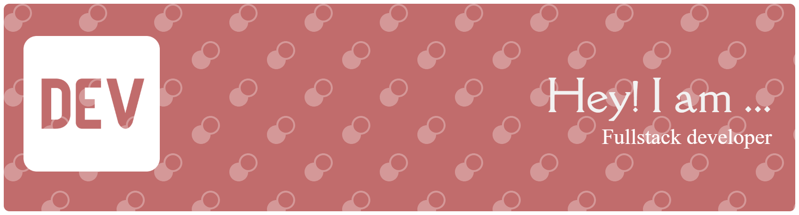

  

<h1 align="center">Hi there, I'm Nandini Saxena✨</h1>

  <b>Full Stack Developer · Android Developer · AI/ML Explorer</b> 
  <i>Smart apps. Secure systems. Meaningful experiences.</i>

  
  
  
  

---

## 🪴About Me

- 🎓B.Tech CSE student at **Amity University, Gwalior** (SGPA: 9.07)
- 🌱Currently learning **Advanced Java (Spring Boot, Servlets, JSP)**, DSA (DP, Greedy, Backtracking), and basics of **Cloud & GenAI**
- 🤝Looking to collaborate on **beginner-to-intermediate projects** in Python, Java, or Android
- 💡Ask me about **Python development, Android apps, hackathons, and getting started with backend development**
- ✨Fun fact: I'm not chasing "expert" titles — I focus on learning by building and improving consistently

---

## 🎯What I'm Into

- 🌐Full Stack Web Development
- 🤖AI / ML & LLM Integration
- 📊Data Analytics & Visualization
- 📱Android Development (Kotlin)
- 🔐Cryptography & Secure Systems
- 🧩DSA & Problem Solving

---

# 📊GitHub Stats:

  
  

  

**Backend & Frameworks**  

**AI / ML & Data**  

**Data Analytics & Cloud**  

**Android Development**  

**Tools**  

---

  <i>"Build. Break. Learn. Repeat."</i>

